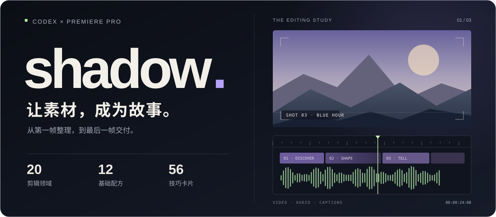

<p align="center">
  <picture>
    <source media="(max-width: 600px)" srcset="docs/assets/shadow-hero-mobile.svg">
    
  </picture>
</p>

<p align="center"><strong>把常用剪辑经验，变成随时可调用的工作流。</strong><br>素材整理 · 包图网补材 · 时间线 · 字幕与标题 · Premiere 交付</p>

<p align="center">
  <a href="https://github.com/Sh4d0W0728/shadow/releases/latest/download/shadow.zip"></a>
  <a href="#快速开始"></a>
  <a href="https://github.com/Sh4d0W0728/shadow/releases"></a>
</p>

<p align="center"><sub>v2.3.0 · Codex 插件 · Premiere Pro · Windows 优先 · MIT</sub></p>

---

## 留更多时间，给故事本身

整理文件、找补充镜头、对齐字幕、准备交接——这些重复步骤都有章可循。shadow 把它们整理成领域流程与本地工具，让 Codex 依据你的素材、参考片和要求推进剪辑。具体镜头、节奏和情绪，仍从真实画面与声音出发。

<picture>
  <source media="(max-width: 600px)" srcset="docs/assets/shadow-workflow-mobile.svg">
  
</picture>

| 你交给 shadow 的工作 | 得到什么 |
| :--- | :--- |
| **整理一堆素材** | 看实际画面、按内容分类编号、复制到指定目录，附原名对照与可浏览目录 |
| **补齐缺少的镜头** | 按主体、动作、景别与色调搜索包图网，会员下载后统一归档 |
| **把想法落到时间线** | 叙事选片、镜头用途、自然转场、音轨安排及可校验的时间线 |
| **做好字幕和标题** | 序列音频识别、文稿校对、UTF-8 SRT、片头、章节字与人物条 |
| **带进 Premiere 继续做** | XML、独立 SRT、素材引用和成片核验；具备编辑器控制时保存原生工程 |

## 把原片交进来，把秩序带回去

**给一个原始视频文件夹，再指定整理后的存放位置。** shadow 会递归扫描，提取真实画面供 Codex 识别，写下内容摘要与标签，再把原片按类别编号、复制到目标目录。

```text
$shadow 整理 D:\拍摄原片，放到 E:\项目\整理素材。
识别视频实际内容，按人物、场地、产品、活动等分类编号。
保留原片，附原文件名对照表；不确定的单独放待复核。
```

| 整理步骤 | 结果 |
| :--- | :--- |
| **读入与去重** | 递归读取视频、记录技术信息，相同内容只整理一份并保留全部来源 |
| **查看与识别** | 带时间点的真实抽帧、内容摘要、标签；长片或混合场景按需补看 |
| **分类与编号** | 10 个默认内容分类，也可按你的目录规则；原片保留，目标副本带编号与内容短标题 |
| **核验与查找** | SHA-256 校验、CSV 原名对照、可点开视频的 HTML 素材目录 |

无法读取的文件和识别不确定的内容分别放入 **98_无法读取**、**99_待复核**。非视频文件列入跳过清单。相同计划可续做，遇到同名冲突会停止；新增批次使用独立目标目录。画面识别由 Codex 查看实际采样完成，抽样记录会保留，不能等同于逐帧看完全片。

[查看分类整理流程与命令 →](shadow/skills/shadow/references/organize.md)

## 同样是剪辑，每种片子都有自己的逻辑

**20 个细分领域，按成片目的选择。** 用户给定的规格、文稿和参考片优先于模板；混合用途可以共用素材库，分别交付。

| 领域 | 工作流与判断重点 |
| :--- | :--- |
| **宣传推广 · 5** | 品牌形象 / 企业能力 / 产品展示 / 文旅推广 / 服务与课程招生。把价值主张与真实证据对应起来。 |
| **活动与会议 · 3** | 当天快剪 / 活动回顾 / 完整会议演讲。分别优先截止时间、流程覆盖和讲话完整性。 |
| **网络教学 · 3** | 系统课程 / 单知识点微课 / 屏幕操作教程。保留知识递进、关键步骤和可复现结果。 |
| **采访与纪实 · 2** | 人物采访 / 观察式纪录。从观点、行动与现场关系组织内容。 |
| **音乐与影视 · 3** | 歌词叙事 MV / 节奏动作混剪 / 影视人物混剪。由情绪、节拍或人物关系推动选镜。 |
| **生活与社交 · 4** | 婚礼故事 / 知识资讯 / 销售转化 / 个人旅行。围绕人物、信息、行动目标与真实体验展开。 |

每个领域都配有必要输入、结构起点、转场动机、字幕与标题策略、交付物和质量关卡。[浏览领域库 →](shadow/skills/shadow/references/domains.md)

## 从公开教学，走到每一个剪辑决定

**18 个专题，接入完整成片流程。** 知识来源扩展到影视飓风公开教学、Frame.io 的剪辑师访谈与原创教学、EditMentor 和 Adobe 官方文档。每项保留来源与实际阅读范围，按“何时使用 → 怎样执行 → 怎样检查”整理。

| 方法库 | shadow 怎样用到你的素材上 |
| :--- | :--- |
| **叙事与剪口 · 4** | 带时间码的选片、采访原意、动作接剪、声音桥与有意义的停顿 |
| **Premiere 精修 · 6** | 三点编辑、多机位、色彩匹配、对白修复、音乐闪避、字幕与标题 |
| **影视飓风学习卡 · 8** | 镜头意义、蒙太奇、宣传目标、节奏密度、人声动态、源包与归档 |

先建立可追溯镜头库，再组织段落；精剪按故事、剪口、节奏、声音、色彩、文字逐轮解决问题，最后从观众角度复核。宣传片、活动快剪、课程、采访纪实、MV 和人物故事使用不同的组织方式。重要决定和修改结果留在项目计划中，方便继续做。

[从素材到成片 →](shadow/skills/shadow/references/editorial-playbook.md) · [叙事与剪口 →](shadow/skills/shadow/references/story-craft.md) · [Premiere 精修 →](shadow/skills/shadow/references/premiere-craft.md) · [影视飓风来源 →](shadow/skills/shadow/references/mediastorm.md)

影视飓风部分已阅读 4 条完整可得公开字幕，另收录 1 份官方快捷键功能清单；其他来源为实际读到的官方正文或作者教学。未取得正文的课程只列为待学。方法整理与软件操作建议不代表作者合作或认证；本次未逐帧观看所有案例或进行听感验收，复杂原生精修仍需在实际 Premiere 工程中执行和验证。

## 快速开始

**Windows：下载、解压、双击。**

1. [下载 shadow.zip](https://github.com/Sh4d0W0728/shadow/releases/latest/download/shadow.zip)，完整解压。
2. 双击 **安装shadow.cmd**。
3. 在 Codex 新开对话，用 **`$shadow`** 开始剪辑。

本机需要支持 `codex plugin` 的 Codex 和 Git。实际剪辑还需要 Python 3.10+、FFmpeg/ffprobe；ASR、字体与 Premiere 按任务准备，skill 会先检查环境。[查看运行环境 →](shadow/skills/shadow/references/setup.md)

<details>
<summary><strong>用终端安装</strong></summary>

```powershell
codex plugin marketplace add https://github.com/Sh4d0W0728/shadow.git --ref main
codex plugin add shadow@shadow
```

安装后新开对话即可调用。插件安装机制见 [OpenAI 官方文档](https://developers.openai.com/plugins/build/plugins)。安装包不含 Codex 本体。

</details>

<details>
<summary><strong>更新到仓库最新版本</strong></summary>

双击 **更新shadow.cmd**，或执行：

```powershell
codex plugin marketplace upgrade shadow
codex plugin add shadow@shadow
```

默认跟随本仓库 `main` 分支。脚本只在运行时检查更新；Release 页面保留已发布的版本包和 SHA-256 校验文件。

</details>

<details>
<summary><strong>环境检查、离线安装与旧版迁移</strong></summary>

Windows 环境检查：

```powershell
powershell -NoProfile -ExecutionPolicy Bypass -File .\install-shadow.ps1 -CheckOnly
```

这里的 Bypass 只用于本次进程，不改变系统策略。找不到 CLI 时增加 `-CodexPath "完整的codex.exe路径"`。

离线安装：

```powershell
powershell -NoProfile -ExecutionPolicy Bypass -File .\install-shadow.ps1 -Local
```

离线模式需要保留解压目录，不提供 GitHub 更新。同名本地来源会让联网安装/更新明确停止；切换前先通过 Codex 移除该本地市场配置。

旧 `shadow@shadow-local` 与 GitHub 版可以共存。确认新版可用后，在插件页面停用旧版，避免两个同名 skill 同时生效。素材和项目始终放在插件目录之外。

</details>

## 一句话，开始下一条片子

**企业宣传片**

```text
$shadow 用这些素材剪一条企业宣传片，面向客户，90秒，16:9，25fps。
先整理真实业务镜头，再列包图网需要补的氛围素材。
交付 Premiere 工程、成片和 SRT。
```

**活动当天快剪**

```text
$shadow 今天活动结束后要发一条45秒竖屏快剪。
保留开场、核心发言一句、观众反应和合影。
先检查缺少的素材，再开始剪。
```

**系统网络课程**

```text
$shadow 把这套录屏和讲稿整理成网络课程。
按知识点分章，保留操作因果，结合音频识别与讲稿校正字幕。
输出分课视频、SRT 和 Premiere 交接文件。
```

## 交付清楚，继续创作也顺手

**包图网**通过 Codex 当前可用的浏览器能力操作，登录验证由用户完成；下载后记录原文件、来源和授权附件。插件不保存密码、Cookie 或令牌，会员素材不随仓库分发。

**字幕识别**使用本地 faster-whisper，以剪辑后序列音频为时间依据，再结合文稿校对。首次准备依赖或模型需要联网，也可以指定本地模型；人名、数字、歌词和重叠说话需要复核。

**Premiere 交接**包含 XML 和独立 SRT。原生 `.prproj` 要在 Premiere 中实际导入、保存与重开；能否自动操作取决于本机软件和 Codex 的桌面控制能力。脚本标题是可重新生成的透明图层，PR 原生可编辑文字、复杂变速、稳定和精细调色在编辑器中处理。

<details>
<summary><strong>开发、验证与持续维护</strong></summary>

从 GitHub 克隆源码后，在仓库根目录运行：

```powershell
python -X utf8 scripts/validate_plugin.py
python -X utf8 -m unittest discover -s tests -v
python -X utf8 scripts/build_release.py --tag v2.3.0
```

提交和 PR 会运行 Windows / Ubuntu 校验。发布 Release 后，工作流核对版本并生成两个 ZIP 与 SHA-256 清单。安装 ZIP 只包含使用所需文件，开发脚本和测试在源码仓库中。结构检查通过不代替实际媒体、声音或 Premiere 验收。

[维护指南](docs/maintaining.md) · [完整 Skill](shadow/skills/shadow/SKILL.md) · [基础配方](shadow/skills/shadow/references/workflows.md) · [技巧卡](shadow/skills/shadow/references/techniques.md)

</details>

---

<p align="center"><strong>shadow</strong> · 让素材，成为故事。<br><sub>Built for Codex × Premiere Pro</sub></p>

<p align="center"><a href="https://github.com/Sh4d0W0728/shadow/issues">反馈问题</a> · <a href="CHANGELOG.md">更新记录</a> · <a href="LICENSE">MIT License</a></p>
